# Spielmechanik-Audit · 2026-08-06

## Umfang und Ziel

Geprüft wurde der vollständige spielbare Ablauf von Level 1 bis 6 im lokalen Testmodus. Ziel ist eine
gemeinsame Beamererfahrung, bei der in jedem Abschnitt eine andere Person eine verständliche, aber
nicht triviale Aufgabe übernimmt. Die verborgene Lebensperspektive soll aus der Mechanik entstehen.

## Schritt 1 · Bleibe — umgesetzt

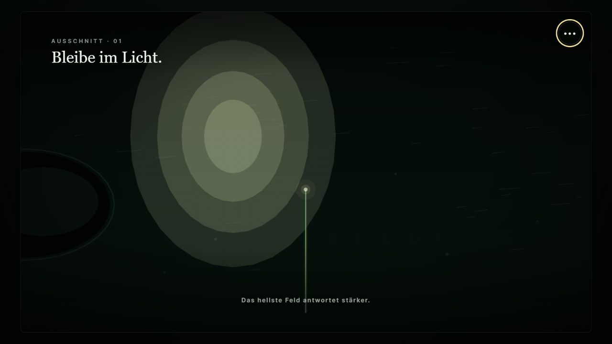

**Stärke:** Licht, Trägheit und die Bindung an einen Ursprung sind sofort lesbar.

**Risiko:** Der Halm startet bereits vollständig ausgewachsen. Das Lichtfeld ist sehr groß und driftet
nur seitlich. Dadurch fehlen Fortschritt, steigende Schwierigkeit und ein Grund für präzise Steuerung.

**Empfehlung:** Wachstum aus tatsächlicher Lichtzeit ableiten; kurze Reichweite zu Beginn; kleiner
werdendes Licht; Sonnenbogen mit Untergang, kurzer Dunkelphase und Wiederaufgang.

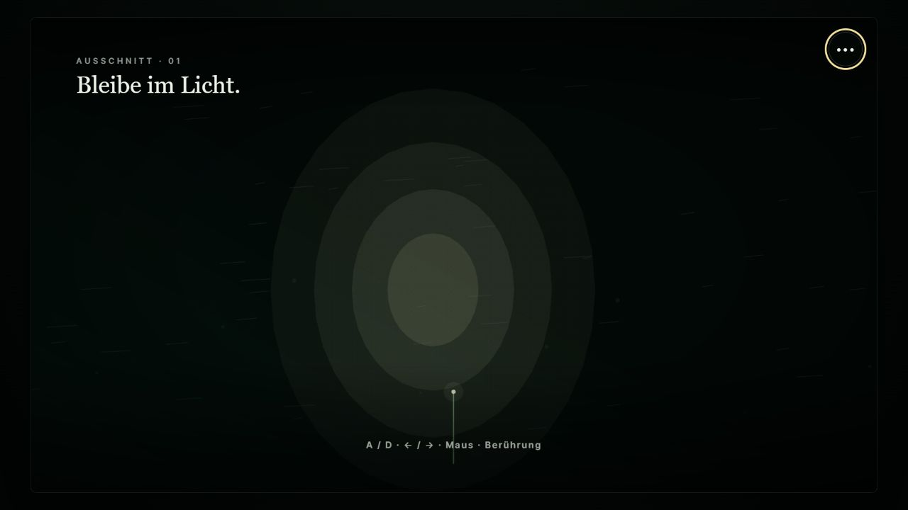

**Ergebnis:** Der Halm beginnt kurz. Lichtkontakt vergrößert Länge, Reichweite und Beweglichkeit. Das
Licht wandert nun als Sonnenbogen, verschwindet vollständig und steigt von der anderen Seite wieder
auf; sein Zielbereich wird im Verlauf kleiner.

## Schritt 2 · Folge — grundlegend neu aufgebaut

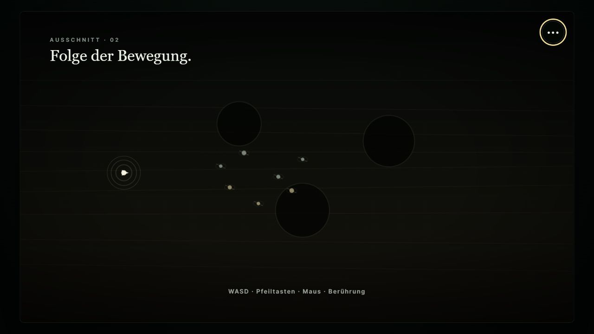

**Stärke:** Gruppe und Gefahrenmotiv sind abstrakt erkennbar.

**Risiko:** Die Gruppe bewegt sich zeitgesteuert durch einen fast leeren Korridor. Der Spieler kann
weitgehend stehen bleiben. Das Grasfressen, Konkurrenz und die körperliche Abhängigkeit von Energie
werden mechanisch nicht erfahrbar.

**Empfehlung:** Slither-artiger Nahrungskreislauf mit schrumpfender Energie, Wachstum durch Sammeln,
konkurrierenden Sammlern und zwei Jagdphasen: zuerst wird ein anderes Signal erbeutet, danach der
Spieler trotz Flucht zunehmend eingeholt.

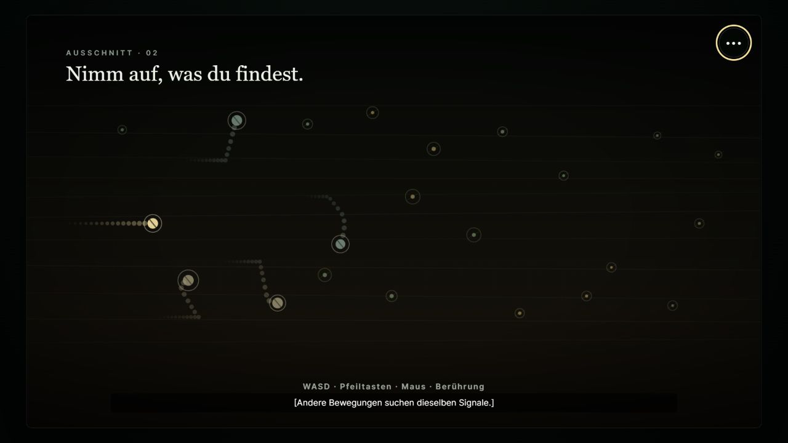

**Ergebnis:** Aufgerichtete Nährfelder, vier kompakte Signalkörper und kontinuierlicher Energieverlust
bilden eine aktive Schleife. Individuelle Zielwahl und Abstandssteuerung verhindern identische Bahnen
und längerfristige Überlagerungen. Die Bedrohung erscheint nach etwa 19 Sekunden, trägt ungefähr nach
30 Sekunden einen Konkurrenten fort und wechselt danach auf den Spieler. Dessen Geschwindigkeit sinkt
schrittweise, ohne das Ende als Versagen zu codieren.

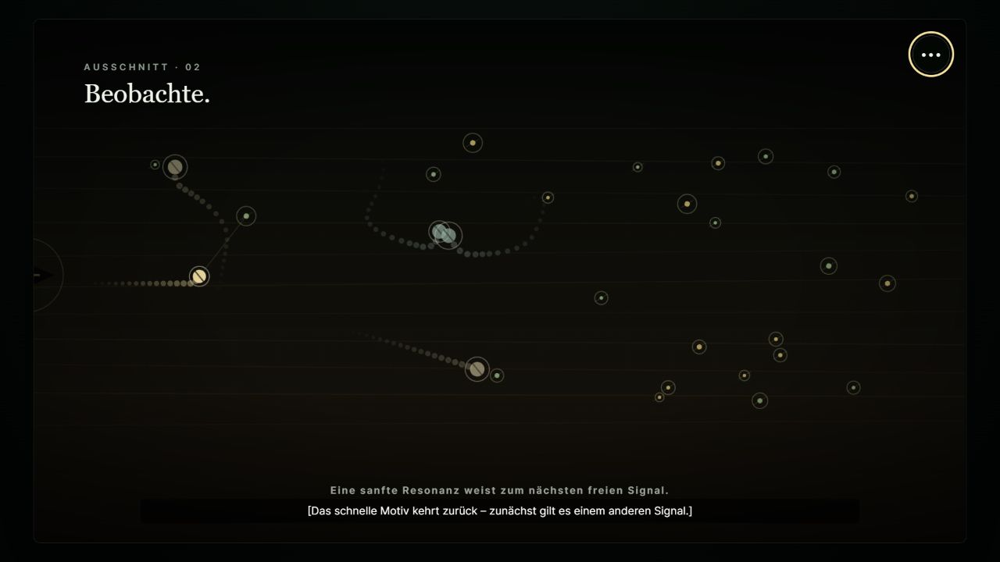

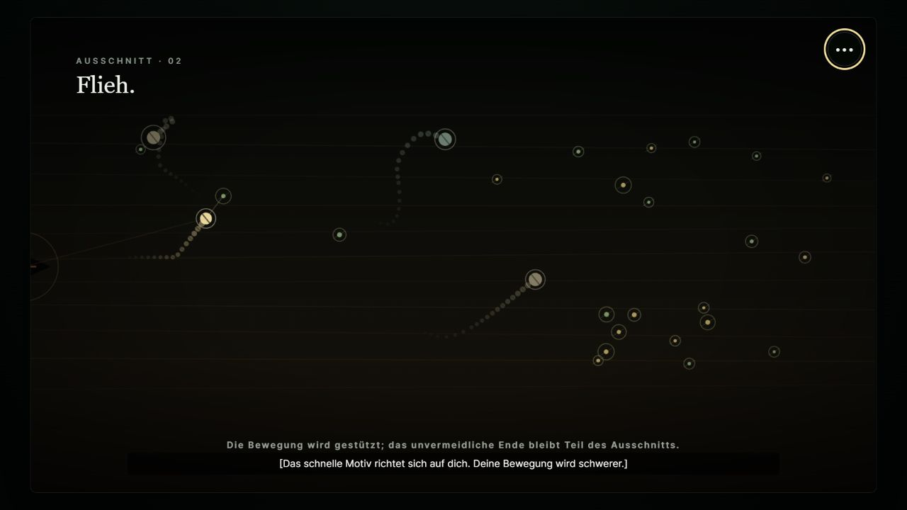

## Schritt 3 · Versorge — aktiver Rollenwechsel

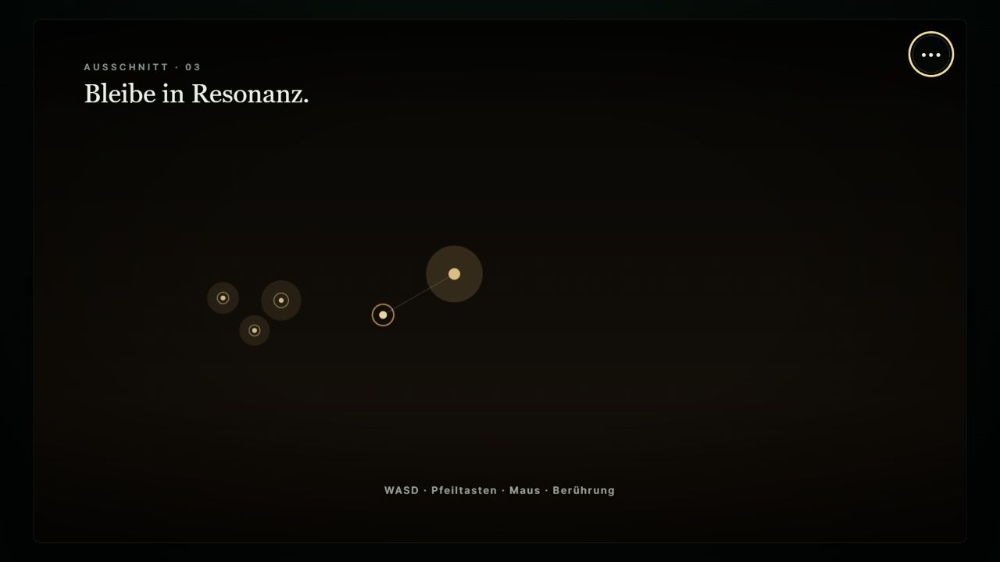

**Stärke:** Empfangen und späteres Versorgen bilden einen guten Rollenwechsel.

**Risiko:** Die erste Phase verlangt nur Nähe; die spätere Ressource ist ein einzelnes statisches Ziel.

**Empfehlung:** ankommende Energiepulse aktiv aufnehmen; Spur als Folge von Wegpunkten lesen;
getragene Energie auf dem Rückweg verlieren können; Risiken räumlich umfahren.

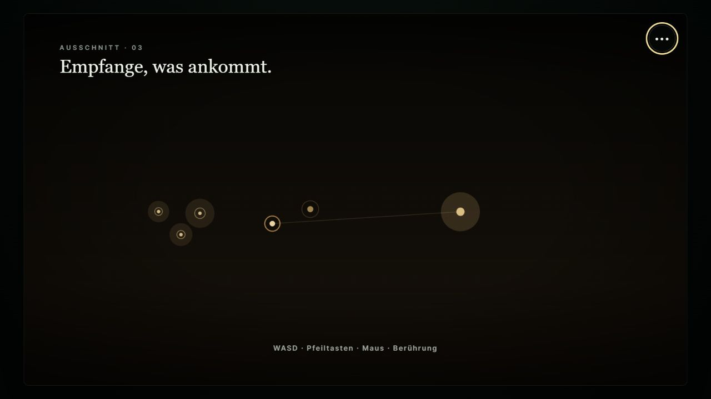

**Ergebnis:** Vier ankommende Versorgungspulse machen den Einstieg aktiv. Nach dem Zeitsprung wird
die gewählte Spur über mehrere Etappen lesbar; ein räumliches Risikofeld schwächt die getragene
Ressource, verhindert den Abschluss aber nicht.

## Schritt 4 · Bewahre — Route mit Risiko

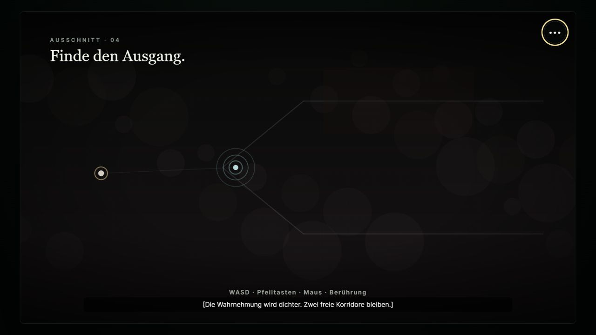

**Stärke:** Zwei Korridore und das vertraute Signal ergeben eine klare Wahl.

**Risiko:** Rauch ist überwiegend Kulisse, der Weg öffnet sich unabhängig vom Verhalten. Obere und
untere Route unterscheiden sich kaum.

**Empfehlung:** bewegliche Rauchfelder und eine abstrakte Klarheitsresonanz; Nähe zum vertrauten
Signal bietet Schutz; kurzer riskanter gegen längeren sicheren Weg; spätere Entscheidung zum
Weitergehen bleibt unvermeidlich, aber spielerisch spürbar.

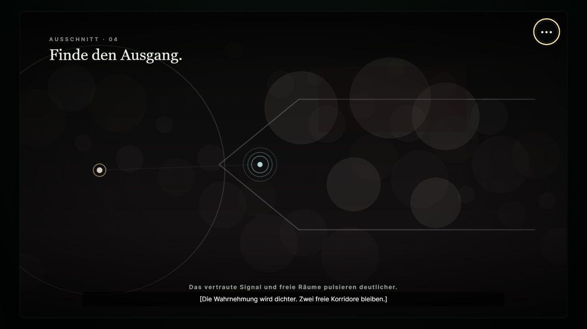

**Ergebnis:** Rauchfelder bewegen sich und beeinflussen die Wahrnehmungsklarheit sowie die mögliche
Geschwindigkeit. Nähe zum vertrauten Signal lässt Klarheit zurückkehren. Die obere Route ist deutlich
dichter mit Rauch belegt als der untere Weg.

## Schritt 5 · Verbinde — spielbarer Rhythmus

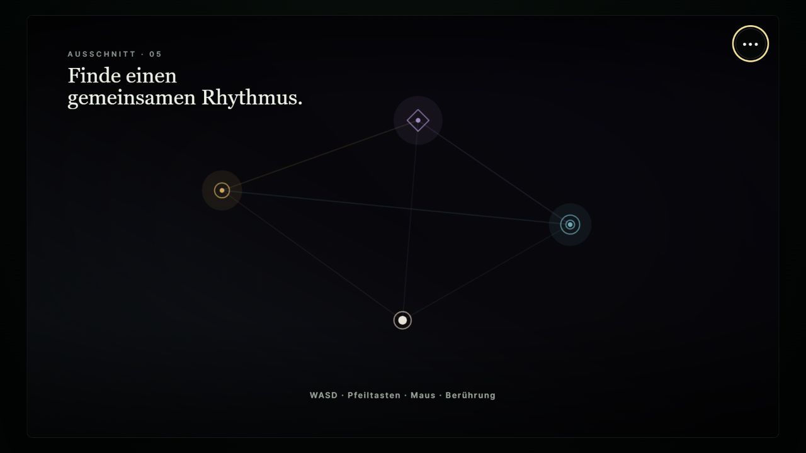

**Stärke:** Formen, Farben, Verbindungslinien und die Mehrphasigkeit vermitteln Beziehung überzeugend.

**Risiko:** „Gemeinsamer Rhythmus“ entsteht durch bloße Nähe und langsame Bewegung. Es gibt keine
erkennbare Taktaufgabe und kaum Feedback für einen gelungenen Moment.

**Empfehlung:** sichtbare Pulsfenster mit Leertaste oder Berührung beantworten; Treffer erzeugen
hör- und sichtbare Harmonie; Rettungsversuche sollen jeweils kurz wirken und dann wieder versagen.

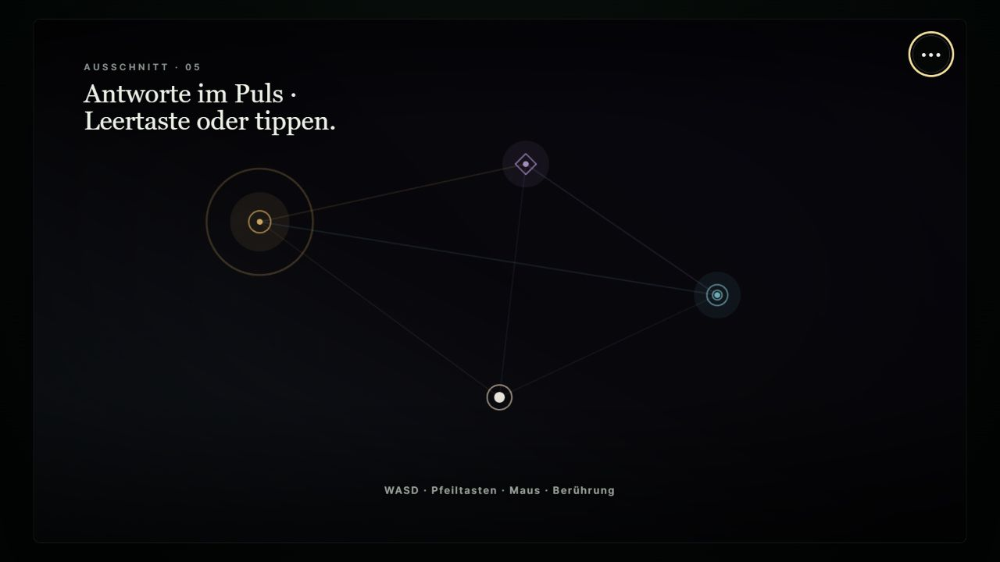

**Ergebnis:** Ein zum Zentrum laufender Ring zeigt das Antwortfenster. Leertaste und Antippen lösen
dasselbe Ereignis aus; Treffer verstärken Klang, Verbindung und Licht. Spätere Rettungsversuche
hellen das schwächer werdende Beziehungssignal nur kurz auf und können den Verlust nicht verhindern.

## Schritt 6 · Lass los — Aktivität vor Loslassen

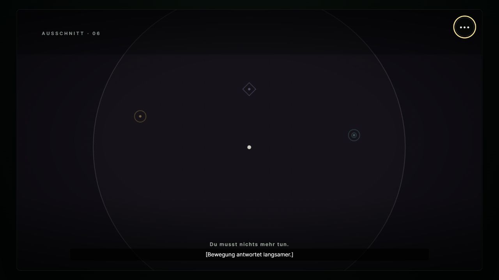

**Stärke:** Kontrollverlust und kleiner werdendes Wahrnehmungsfeld sind schlüssig und barrierearm.

**Risiko:** Schon zu Beginn ist Nichtstun die wirksamste Strategie. Dadurch fehlt der Kontrast zwischen
einem letzten aktiven Erinnern und dem später notwendigen Loslassen.

**Empfehlung:** zunächst vertraute Erinnerungssignale aufsuchen; danach Kanäle stufenweise verlieren;
die für den Abschluss nötige Ruhephase erst beim eigentlichen Loslassen beginnen.

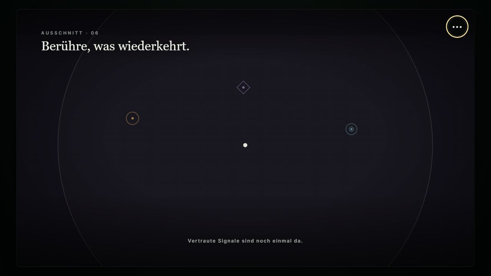

**Ergebnis:** Drei wiederkehrende Formen müssen zunächst aktiv berührt werden und verbinden sich
sichtbar mit dem Spieler. Erst ab dem dramaturgischen Wendepunkt zählt ruhende Eingabe als Loslassen;
reines Nichtstun ab Levelstart ist nicht mehr die optimale Strategie.

## Übergreifende Chancen

- Alle Level brauchen einen wiederkehrenden 5- bis 15-sekündigen Entscheidungszyklus.
- Erfolg soll als Veränderung der Welt sichtbar werden, nicht als Punktestand.
- Unvermeidliche Enden bleiben von Geschicklichkeit getrennt.
- Wichtige Signale werden weiterhin über Farbe, Form, Bewegung und Klang gemeinsam codiert.
- Leertaste und Berührung müssen dieselben aktiven Impulse auslösen können.

## Evidenzgrenzen

Die Screenshots belegen Hierarchie, visuelle Dichte und erkennbare Zustände. Timinggefühl,
Klassenraumlautstärke, motorische Schwierigkeit und emotionale Wirkung müssen zusätzlich in einem
regulären Unterrichtsdurchlauf getestet werden. Eine vollständige Barrierefreiheitskonformität lässt
sich aus diesen Aufnahmen nicht ableiten.

## Technische Prüfung und Gesamtzustand

- TypeScript-Typprüfung: bestanden
- Produktions- und Offline-Build: bestanden
- Lernseiten-Validator: bestanden; zwei erwartete Lehrerblöcke im lokalen Autorenentwurf
- Browserkonsole: keine Fehler oder Warnungen aus dem Spielcode
- Zustandswechsel und direkte Levelstarts: in allen sechs Leveln geprüft

**Gesamtzustand:** technisch stabiler und visuell konsistenter Unterrichtsprototyp. Die größten
Monotonierisiken sind mechanisch beseitigt. Offen bleiben ein regulärer 30- bis 35-minütiger
Klassenraumtest, die Feinabstimmung der realen Schwierigkeitskurve und die endgültigen Filmmedien.
